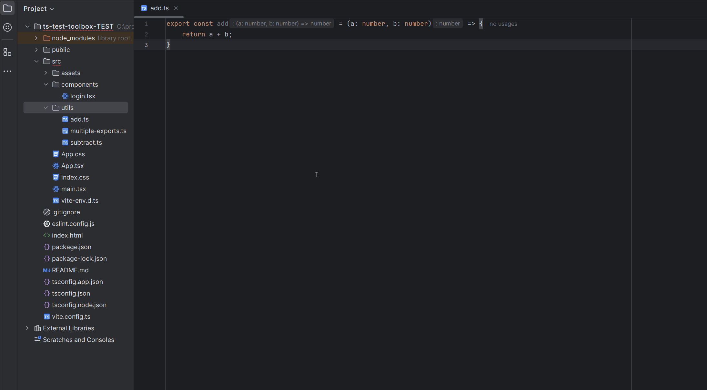

<!-- Plugin description -->

# ts-test-toolbox

**Unit tests:** Adds a context menu item in WebStorm to generate a `.test.ts` or `.test.js` file for any JS/TS file.

**Storybook:** Adds a context menu item in WebStorm to generate a `.stories.ts` or `.stories.js` file for any JSX/TSX file.

## Features

- ✅ Right-click any `.ts` or `.js` file to create a matching test file.
- ✅ Automatically includes `describe` and `it` blocks for each exported function.
- ✅ Detects whether you're using `vitest` or `jest` by checking `package.json`.
- ✅ Opens the created test file in the editor automatically.
- ✅ Prevents duplicate test file creation.
- ❌ Hides the menu on `.test.ts` and `.spec.ts` files.

## Example

If you have:

```ts
// my-functions.ts
export function getName() { ... }
export function getAge() { ... }
```

The generated test will be:

```ts
// my-functions.test.ts
import { describe, it, expect } from 'jest'
import { getName, getAge } from './my-file'

describe('getName', () => {
  it('should work', () => {
    const result = getName()
    // expect(result).to...
  })
})

describe('getAge', () => {
  it('should work', () => {
    const result = getAge()
    // expect(result).to...
  })
})
```
<!-- Plugin description end -->

